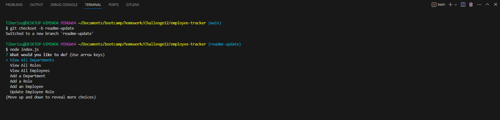

# Employee Tracker

## employee-tracker

## Description

This command line tool allows for users to view, edit, and add information regarding employees. This application uses Inquirer, MySQL for the database, and dotenv npm packages to manage employees.

## Table of Contents

- [Installation](#installation)
- [Usage](#usage)
- [Contribution](#contribution)
- [Tests](#tests)
- [License](#license)
- [Questions](#questions)

## Installation

Run npm i to install the necessary dependencies. You will need to include a .env file that includes MySQL credentials to properly connect to your MySql database.

## Usage

Run npm start and you'll be presented with the CLI to manage the employee database. You'll also want to ensure you run your schema and seeds sql files to get your db set up and seeded with starter data.

## Contribution

N/A

## Tests

N/A

## License

N/A

## Questions

You can reach me at danielwatkins@byu.net or find me at https://github.com/dan-watkins
